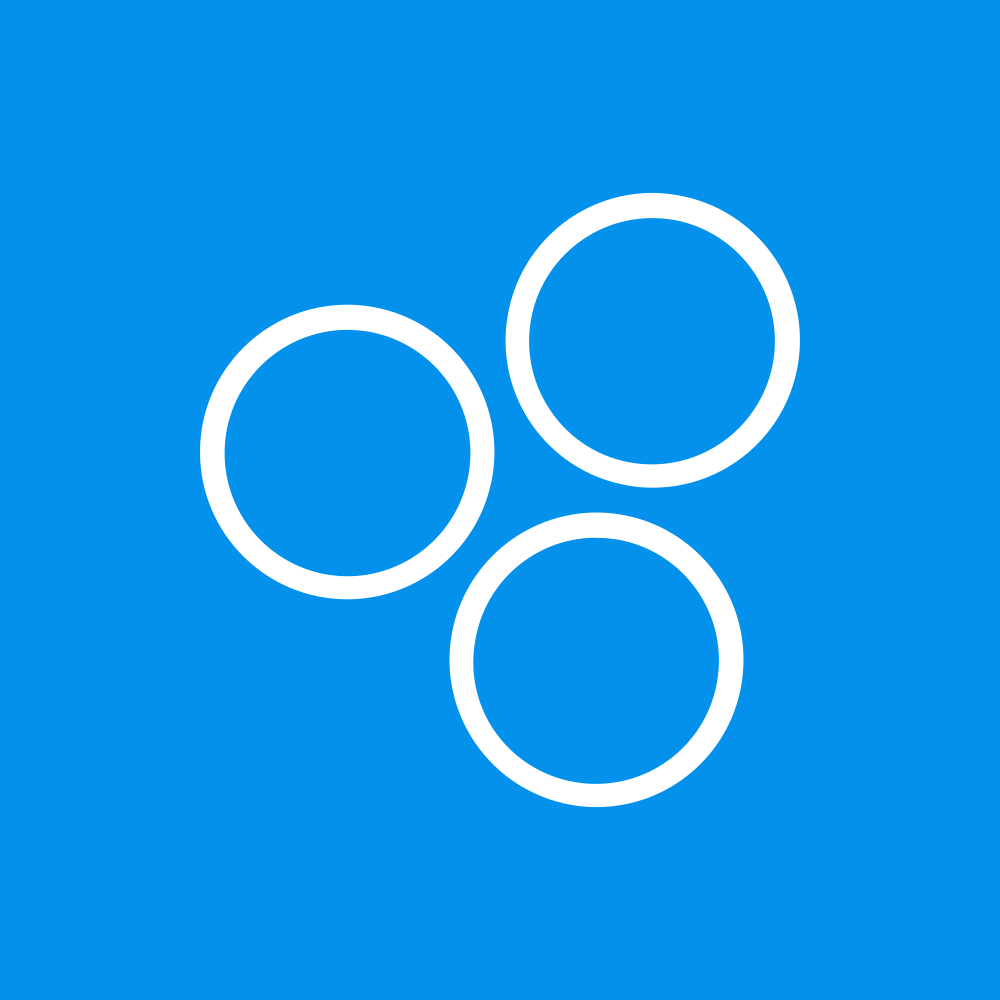

# Who's using fp-ts?

 

 

 

 

 

 

 

 

 

 

 

 

 

 

 

 

 

 

 

 

 

 

 

 

 

<a target="_blank" rel="noopener" href="https://github.com/gcanti/fp-ts/issues/1124">
  + your company?
</a>
